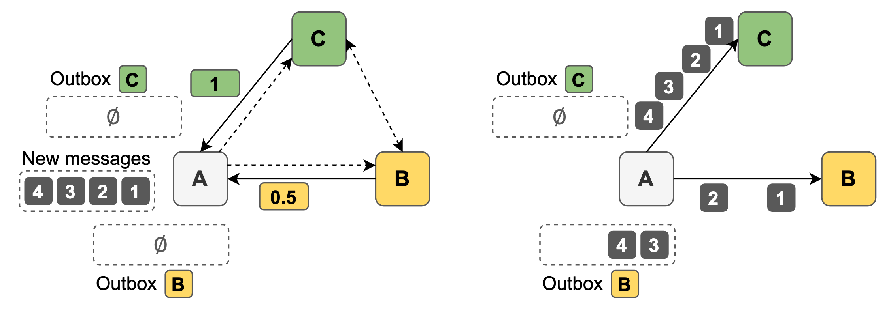

# Healthor: Heterogeneity-aware Flow Control in DLTs to Increase Performance and Decentralization

> This repository contains an [OMNeT++-based simulator](#simulator) written in C++ and a [Python framework to analyze and plot results](#python-plotting-framework) as part of my [Master's thesis](assets/2021-03-19-thesis.pdf). It can be used to [reproduce results](#reproducing-experiment-results) shown in my thesis. A [dataset](https://doi.org/10.5281/zenodo.4573698) containing raw simulation data can be obtained separately. 

Healthor is a novel heterogeneity-aware, lightweight flow-control mechanism for permissionless reputation-based DLT networks. It captures heterogeneity by defining a node's *health* as a function of its processing power and the current network activity. The health updates of neighboring nodes are then used to calculate the message forwarding rates, thus dynamically adjusting the flow control per node. This basic mechanism allows high-end nodes to buffer messages for unhealthy nodes, thus protecting weaker nodes from being overwhelmed with wasted processing and rapidly adapting network load and bursts. With such a flow-control design more nodes are able to keep up with ledger updates and participate in DLT consensus, therefore increasing decentralization and network performances. 

The project was developed in the context of my [Master's thesis](assets/2021-03-19-thesis.pdf) at [Vrije Universiteit Amsterdam](https://www.vu.nl/en/) in the program [Parallel and Distributed Computer Systems](https://vuweb.vu.nl/en/education/master/parallel-and-distributed-computer-systems) in cooperation with the [IOTA Foundation](https://www.iota.org/). Thanks to my supervisors Animesh Trivedi, Lin Wang (VU Amsterdam) and Luigi Vigneri (IOTA Foundation) for their continuous support and contributions.

### Other publications
Jonas Theis, Luigi Vigneri, Lin Wang, and Animesh Trivedi. 2020. \
*Healthor: Protecting the Weak in Heterogeneous DLTs with Health-aware Flow Control.* \
In Proceedings of the 4th Workshop on Scalable and Resilient Infrastructures for Distributed Ledgers (SERIAL'20). Association for Computing Machinery, New York, NY, USA, 5–8. DOI:https://doi.org/10.1145/3429884.3430033

## Workings of Healthor
The basic idea behind the protocol is to rate-limit message 
forwarding in a DLT network based on neighbor's current message processing capacity, termed as its *health*. Intuitively, the notion of health captures the dynamic heterogeneity of the DLT network, that might be changing over time. The figure below presents an example showing the intuition behind Healthor's design at a high level. The figure shows a DLT network with 3 nodes (A, B, and C). Node A has new messages to forward to nodes B and C. Before A calculates the forwarding rate, it receives the health updates (0.5 for B, 1.0 for C), and then calculates the rate based on the updates. Here in this example, node C gets all the messages, whereas B only gets half, while the other half is buffered by node A on the behalf of node B. This basic mechanism is the key insight in our flow-control protocol where more capable nodes can buffer messages to accommodate performance fluctuations in weaker nodes.   



## How to run

**Prerequisites:**
- [OMNeT++ 5.6.2](https://omnetpp.org/download/)
- Python 3
- [rocksdb 6.15.*](https://github.com/facebook/rocksdb/blob/master/INSTALL.md)

```bash
git clone https://github.com/jonastheis/healthor.git

# set up Python venv
cd healthor/plot
python3 -m venv venv
source venv/bin/activate
pip install -r requirements.txt

# run simulations, collect data & create plots
$ python thesismain.py --help                              
usage: thesismain.py [-h] --run-simulation [RUN_SIMULATION] [--microbenchmarks] [--macrobenchmarks] [--attack-analysis] [--centralization-sensitivity-analysis] [--initial-experiment]
                     [--processing-variability]

Simulation running and plotting framework of Healthor. Please make sure that OMNeT++ is set up correctly as described here: https://github.com/jonastheis/healthor.

optional arguments:
  -h, --help            show this help message and exit
  --run-simulation [RUN_SIMULATION]
                        whether to run the simulations or use data already generated in previous simulation runs to generate plots and results (true/false)
  --microbenchmarks     run simulation series and plot results of microbenchmarks with 2 different 10 node networks
  --macrobenchmarks     run simulation series and plot results of macrobenchmarks
  --attack-analysis     run simulations and plot results of attacks
  --centralization-sensitivity-analysis
                        run and plot results of centralization score sensitivity analysis
  --initial-experiment  run simulation and plot results of the initial experiment aided vs unaided
  --processing-variability
                        plot processing variability of various cloud hosting provider

```

Some simulations take multiple hours to complete. To replicate results from existing raw simulation data see [reproducing experiment results](#Reproducing-experiment-results).


## Python plotting framework
The plotting framework is written in Python and builds the single entry point to the simulator. It compiles and runs the simulator as well as processes the result data and plotting it. It heavily utilizes `matplotlib`, `numpy` and `pandas` to do so. The main point of interest is `plot/thesismain.py`. Here all experiments shown in the thesis can be run (can take multiple hours for bigger networks), results reproduced and eventually plotted to `plot/out/t/plots`.


## Reproducing experiment results
Running the plotting framework with `python thesismain.py --run-simulation true` runs everything end-to-end, i.e., simulations specified followed by processing raw data and computing results and plots. This can take multiple hours to complete depending on the network size of the simulations to run.

Running the plotting framework with `python thesismain.py --run-simulation false` allows to reproduce the results and plots shown in the thesis with the [provided dataset](https://doi.org/10.5281/zenodo.4573698). For this to work the desired file of the dataset needs to be extracted into `simulation/results`, as the plotting framework expects raw files to be in this folder. It is important to note that all files out of any `*.tbz2` archive need to be places directly into `simulation/results` (e.g. `simulation/results/LowHealthAttack.csv`).

Available options with `thesismain.py` are as follows, where each argument represents a set of simulations corresponding to a section or subsection in the thesis.
```bash
  --microbenchmarks     run simulation series and plot results of microbenchmarks with 2 different 10 node networks
  --macrobenchmarks     run simulation series and plot results of macrobenchmarks
  --attack-analysis     run simulations and plot results of attacks
  --centralization-sensitivity-analysis
                        run and plot results of centralization score sensitivity analysis
  --initial-experiment  run simulation and plot results of the initial experiment aided vs unaided
  --processing-variability
                        plot processing variability of various cloud hosting provider
```

## Simulator
Healthor's simulator is written in C++ using the discrete event simulation framework [OMNeT++](https://omnetpp.org/). As such, the simulator is single threaded and deterministic due to the use of pseudo-random generators with a determined seed.

The baseline (un)aided heterogeneity simulator can be found in `simulation/basic.cc`. Healthor shares most of the code base with this and extends this class in `simulation/v1.cc`. 
The main point of interest is the `handleMessage` function as every event in OMNeT++ is modeled as a *message* and therefore this method serves as dispatcher depending on a message's type.

### Available message types
Generally, every message ending in *\*Event* is a self-message, i.e., a node uses this to schedule events internally.

**GenerationEvent** \
Called every second as long as a node is not out of sync. It updates a node's generation rate and schedules messages to be created within the next second until the generation rate is updated again.

**CreateMessageEvent** \
Whenever this event is encountered the node issues a TangleMessage and puts it in its own inbox.

**SchedulingEvent** \
Called every second as long as a node is not out of sync. It updates a node's scheduling rate and schedules messages to be processed within the next second until the scheduling rate is updated again.

**ProcessingEvent** \
Takes a message from the inbox and processes it, i.e., writes it to the local ledger and broadcasts it to neighbors in the case of (un)aided. With Healthor, messages are pushed to neighbors' outboxes.

**RequestMessageEvent** \
If a TangleMessage's history is not fully known, i.e., it is not solid, a message needs to be requested potentially multiple times until it is received. This event makes a node send a RequestMessage to all its neighbors.

**RequestMessage** \
A neighboring node misses a message and requests the missing message with a RequestMessage. Upon receipt of a RequestMessage, a node checks whether the message is available locally. If it is, it sends the message back to the requesting node.

**TangleMessage** \
TangleMessages are the core messages of the Tangle data structure, i.e., the distributed ledger. Every node keeps its ledger updated according to the TangleMessages it receives. A TangleMessage contains references to two parent TangleMessages and thus builds an immutable directed acyclic graph.  

The following messages are specific to Healthor.

**HealthMeasurementEvent** and **HealthMessage** \
Both events are part of the *Health Measurement Engine* of a node. The HealthMeasurementEvent is triggered periodically (every second by default) and initiates a health assessment followed by sending the measured health to a node's neighbors via HealthMessage. On receipt of a HealthMessage, a node computes the forwarding rate (Rate Computation engine) for this neighbor.

**PacingEvent** and **SendingEvent** \
Both events are part of the *Pacing Engine* of a node. The PacingEvent is triggered periodically (every second by default) and schedules sending events for every neighbor according to the neighbor's current rate, respectively. The SendingEvent simply determines when a TangleMessage from a neighbor's outbox is sent.

**DefenseEvent** \
Part of the *Defense Engine*. The DefenseEvent is triggered periodically (every second by default) and checks whether neighbors are within their allowed sending rates as well as their outbox occupation over time. If protocol violations are detected, appropriate action (e.g. dropping of the corresponding neighbor) is initiated. 


## License
This project is licensed under the [Apache Software License, Version 2.0](http://www.apache.org/licenses/LICENSE-2.0).

See [`LICENSE`](LICENSE) for more information.

    Copyright 2021 Jonas Theis

    Licensed under the Apache License, Version 2.0 (the "License");
    you may not use this file except in compliance with the License.
    You may obtain a copy of the License at

        http://www.apache.org/licenses/LICENSE-2.0

    Unless required by applicable law or agreed to in writing, software
    distributed under the License is distributed on an "AS IS" BASIS,
    WITHOUT WARRANTIES OR CONDITIONS OF ANY KIND, either express or implied.
    See the License for the specific language governing permissions and
    limitations under the License.